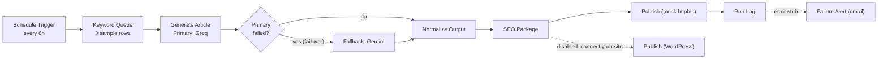

# AI Content Pipeline with LLM Failover (n8n)

An import-ready n8n workflow that generates an SEO article from a keyword queue, survives a primary LLM outage by failing over to a second provider, packages the result for SEO, and publishes it. It runs end to end with zero credentials so you can import it and press Execute in about five minutes.

This is a portable rebuild of the core pattern from a production content system I run: a 9-agent Python publisher that has shipped 658+ WordPress posts and held a 41-day unattended run with zero failed publishes. The production system is custom Python. This demo shows the same architecture expressed in n8n.

## What it does

1. A schedule fires every 6 hours.
2. A keyword queue hands the run one keyword with a difficulty score.
3. The primary model (Groq `llama-3.3-70b-versatile`) writes the article.
4. If that call fails for any reason, an IF gate routes the run to a fallback model (Google Gemini) that uses a separate provider and quota pool.
5. The output is normalized to one contract, then packaged for SEO (slug, 155-char meta description, focus keyword, word count, Article schema).
6. The article is published. The demo publishes to a mock HTTP target so it runs without a real site. A disabled WordPress node sits next to it as the real target.
7. A run log records the outcome: keyword, title, provider used, word count, and publish status.

## Architecture

## Node-by-node walkthrough

| # | Node | Type | What it does |
|---|------|------|--------------|
| 1 | Schedule Trigger | Schedule Trigger | Fires the run on a 6-hour interval. The production scheduler uses a randomized 100 to 140 minute interval per site, which lands around 10 to 14 posts a day. |
| 2 | Keyword Queue | Code | Holds 3 sample keyword rows with difficulty and KD type. It picks one using the same KD-rotation idea as production (favor one hard keyword per two easy ones). Stands in for the production SQLite `keyword_queue` table. |
| 3 | Generate Article - Primary (Groq) | HTTP Request | Calls the Groq chat completions endpoint with `llama-3.3-70b-versatile` and asks for a JSON object of title, article HTML, and meta description. Set to Continue On Fail so an error never stops the run. Auth is an environment expression, so no key is stored in the file. |
| 4 | IF Primary Failed? | IF | Checks whether the primary returned usable content. No content routes the run down the failover branch. |
| 5 | Fallback - Gemini | HTTP Request | Repeats the request against Google Gemini. Different provider, different quota pool, same output contract. This is the failover branch. |
| 6 | Normalize LLM Output | Code | Unwraps whichever provider answered into one shape: title, article, meta. If no key is set and both providers return nothing, it emits a clearly labeled sample article so the pipeline still completes. |
| 7 | SEO Package | Code | Builds the slug, trims the meta description to 155 characters, derives a short focus keyword by dropping stopwords, counts words, and attaches Article schema. |
| 8 | Publish to WordPress (mock) | HTTP Request | Posts the final payload to `httpbin.org/post`, which echoes it back. This makes the whole workflow runnable with no setup and no real site. |
| 9 | Publish to WordPress (real) | WordPress | The official n8n WordPress node, disabled by default. Add your site credential and enable it to publish for real. |
| 10 | Run Log | Code | Writes one outcome summary per run. Mirrors the production `post_log` and `agent_runs` tables. |
| 11 | Failure Alert (disabled) | Send Email | A disabled email stub. Wire it to a node's error output to get failure notifications. |

## Why failover matters

Free and low-cost LLM tiers rate-limit hard. A single provider will return 429 during a burst, go down for maintenance, or deprecate a model out from under you. If your pipeline calls one model and that call fails, publishing stops until a human notices.

The production system this demo is based on runs a six-rung cascade: Groq first, then four NVIDIA NIM models, then Gemini as a last resort on a separate billing pool. When one rung returns a quota or server error, the pipeline drops to the next rung and keeps going. That is the mechanism behind the 41-day unattended run and the 658+ posts with zero failed publishes. The failover is not a nice-to-have. It is the reason the system stays up without a babysitter.

This n8n demo compresses that cascade to two rungs (Groq then Gemini) to keep the canvas readable. The pattern is identical: try a provider, detect failure, route to the next provider, converge on one output contract.

## Honest framing

The production publisher is custom Python with its own SQLite state, WordPress REST client, image sourcing, Rank Math meta, internal linking, and a supervisord watchdog. This repository does not claim to be that system. It is a faithful rebuild of that system's signature pattern in n8n, made runnable and safe to share. If you want the same reliability behavior in a no-code or low-code stack, this is what it looks like.

## Files

- `workflow.json` — the export, import-ready, zero secrets.
- `SETUP.md` — 5-minute import instructions, plus how to add your own Groq and WordPress credentials.
- `SCREENSHOTS.md` — the exact shots to capture for a portfolio listing.

## Credentials and safety

No API keys are stored anywhere in `workflow.json`. The LLM nodes read their keys from environment expressions (`$env.GROQ_API_KEY`, `$env.GEMINI_API_KEY`). With no keys set, the LLM calls fail on purpose, which is what exercises the failover branch and proves it works.
